# IMPLEMENTING A CLIENT-SERVER ARCHITECTURE USING MYSQL DATABASE MANAGEMENT SYSTEM ON AWS

## Introduction

Implementing a client-server architecture using MySQL database management system on AWS involves setting up a MySQL database on an AWS instance and connecting clients to it through a server.

## Prerequisites for the Project

- An AWS account with administrative privileges
- Basic understanding of AWS services (EC2 Security Groups)
- Familiarity with Ubuntu Linux and SSH

## Client-Server Architecture Explained

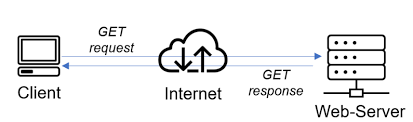

Clients are typically user workstations or personal devices that initiate requests for resources or services from a server. They have a user interface that allows users to interact with the application and display the information received from the server.

Servers are powerful computers that host, manage, and deliver the resources and services requested by clients. They can handle multiple client requests simultaneously and provide security access control.

## How Client-Server Architecture Works

- `Client Requests Service`: A client initiates communication by sending a request for a service or resource to the server. This request could be anything from fetching a web page to retrieving data from a database.

- `Server Processes Request`: The server receives the request from the client and processes it. This may involve executing a specific task, retrieving data from a database, or performing any other operation required to fulfill the client's request.

- `Server Sends Response`: Once the server has processed the request, it sends a response back to the client. This response contains the requested data or indicates the outcome of the requested operation.

- `Client Receives Response`: The client receives the response from the server and takes appropriate action based on the information received. This could involve displaying the requested data to the user, processing it further, or making additional requests to the server.

## Step by Step Implementation Guide

## Step 1 - Set Up AWS EC2 instance and Configure the Security group

Create two security groups:

1. MySQL-client-sg: This group will only allow inbound SSH traffic on port 22.

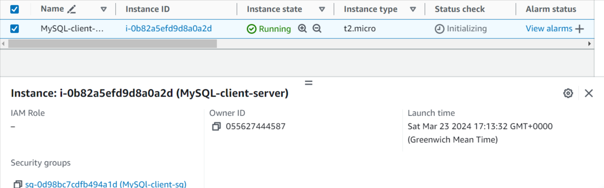

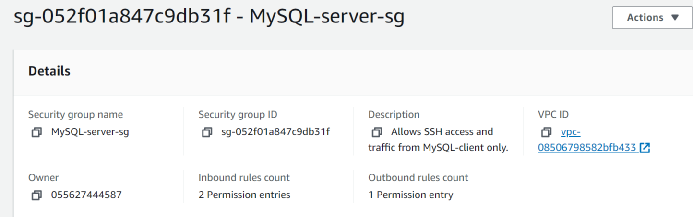

2. MySQL-server-sg: This security group will allow inbound SSH traffic on port 22 and MySQL traffic on port 3306 (only from the client machine's Private IP address to restrict database access).

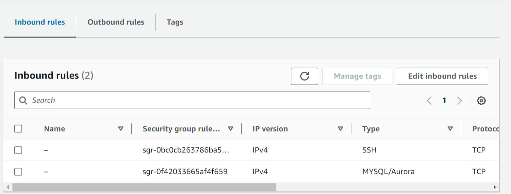

Launch two separate instances one for MySQL server (database-server) the other for MySQL-client (client-machine). Choose Ubuntu distribution as the operating system. Associate the respective security groups (MySQL-client-sg and MySQL-server-sg) with each corresponding EC2 instance.

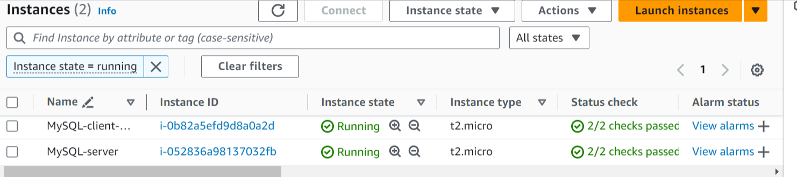

Launch and connect to both EC2 instances.

## Step 2 - Install MySQL Server software on the mysql-server EC2 instance

Update package repository:

```
sudo apt update -y
```

Install MySQL Server

```
sudo apt install mysql-server -y
```

Start the MySQL service and enable it to start automatically at boot with :

```
sudo systemctl start mysql
```

```
sudo systemctl enable mysql
```

Verify the status of Mysql service:

```
sudo systemctl status mysql
```

MySQL server-status

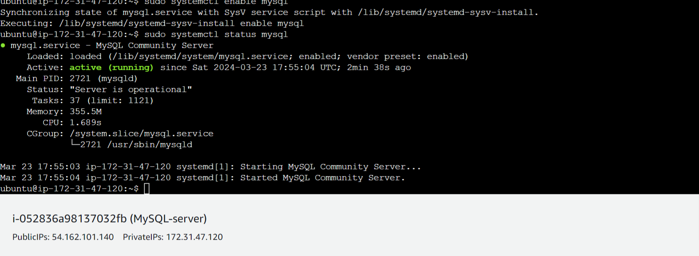

## Step 3 - Install MySQL Client Software on the MySQL-client EC2 Instance

Update package repository:

```
sudo apt update -y

```

Install MySQL Client

```
sudo apt install mysql-client -y
```

## Step 4 - Configure MySQL Server Security, Create Database and User

Connect to MySQL prompt on the mysql-server EC2 instance:

```
sudo mysql
```

Then run the following `ALTER USER` command to change the root user’s authentication method to one that uses a password. The following example changes the authentication method to mysql_native_password to `*********`:

```
ALTER USER 'root'@'localhost' IDENTIFIED WITH mysql_native_password BY '********';
```

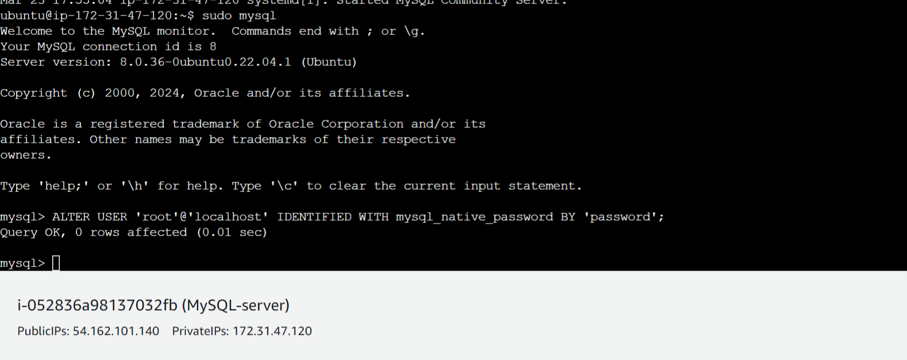

After making this change, exit the MySQL prompt:

```
exit
```

Log back into the mysql console using the root user, you will be prompted to input the password which is "**\*\*\***" in this case.

```
sudo mysql -u root -p

```

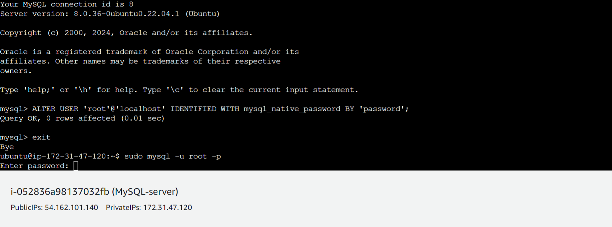

Create a new database and user with privileges to access it. Below is a sample:

```
CREATE DATABASE test_db;
```

```
CREATE USER 'MarshDev'@'%' IDENTIFIED BY 'password';
```

```
GRANT ALL PRIVILEGES ON test_db.* TO 'MarshDev'@'%';
```

```
FLUSH PRIVILEGES;
```

```
exit
```

Confirm the databases present

```
SHOW DATABASES;
```

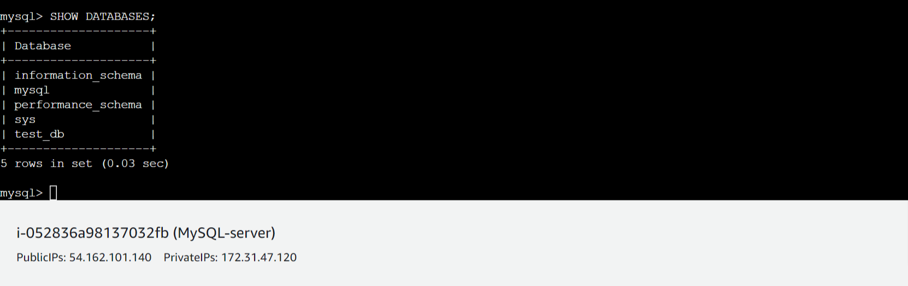

## Step 5 - Configure MySQL server for Remote Access

Open the MySQL configuration file using a text editor:

```
sudo vi /etc/mysql/mysql.conf.d/mysqld.cnf
```

Find the line that starts with `bind-address` and change its value to `0.0.0.0` to listen on all interfaces:

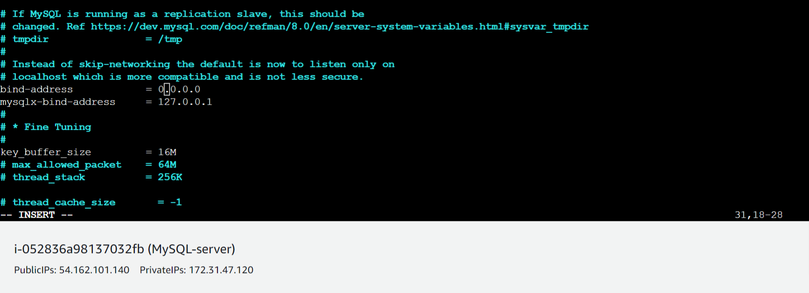

Restart the MySQL service for the changes to take effect:

```
sudo systemctl  restart mysql
```

## Step 6 - Connect to Mysql db server from the MySQL client

Connect to the MySQL server from Mysql client and start querying the Mysql database from the client machine.

```
mysql -u username -h <MySQL-server-private-ip-address> -p
```

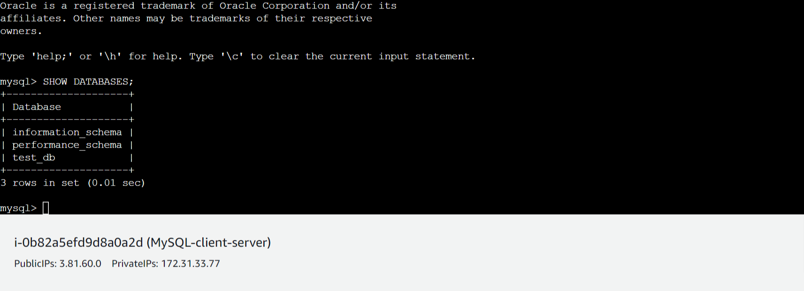

## Important Security Considerations

- Strong Passwords: Always use complex passwords for root and user accounts.

- Minimize Remote Access: If possible, avoid enabling remote access to the MySQL server for enhanced security.

- Security Groups: Restrict access to the MySQL server using security groups, allowing connections only from authorized sources.

- Regular Updates: Keep your MySQL server and operating system software up-to-date with the latest security patches.

## Conclusion:

This guide has comprehensively explained how to build a client-server architecture using MySQL on AWS with Ubuntu Linux. We've learned about client-server principles, set up EC2 instances with security groups, installed and secured the MySQL server, and established a connection from the client to manage our database. Remember to prioritize security by implementing strong passwords, minimizing remote access, and keeping software updated.
